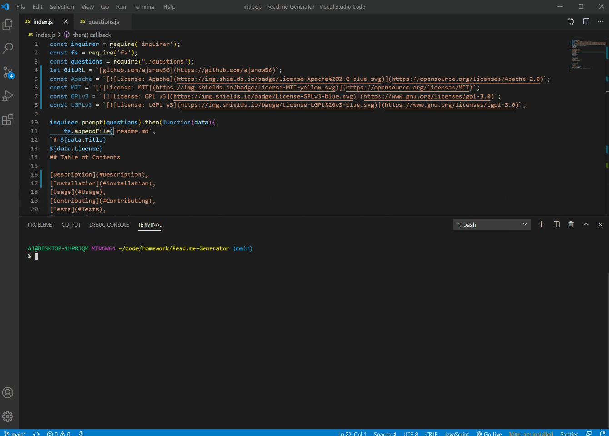

# Readme.md Generator

### This License
The Apache License is a permissive free software license written by the Apache Software Foundation. It allows users to use the software for any purpose, to distribute it, to modify it, and to distribute modified versions of the software under the terms of the license, without concern for royalties.
## Table of Contents

[Description](#Description) [Installation](#installation) [Usage](#Usage) [Test](#Test) [Contribution](#Contribution)[Questions](#Questions)

## Description:
    
This app uses javascript to write a readme.md file based on user inputs, prompted with inquirer. The questions prompts include: Title, license, description, installation, usage and contributing. The license badge will automatically be added to the top of the readme. The user can also enter their github username and email address for contact under the questions header. 
    
## Installation:
    
Node.js and Inquirer are both required
    
## Usage:
    
Using node and inquirer, the user is prompted questions in the terminal after executing node index.js
    
## Test:
 
using your terminal and node one can test for errors

## Contribution:
    
Me Myself and I guess Tucker a little
    
## Questions:
*Follow me on Github at [github.com/ajsnow56](https://github.com/ajsnow56)

*Email me at: ajsnow56@gmail.com

## User Walkthrough
### [View video via Screencastify](https://drive.google.com/file/d/1ZIGjFxPDIgCfk5-H5c6tMRT4gwSJGGmG/view)